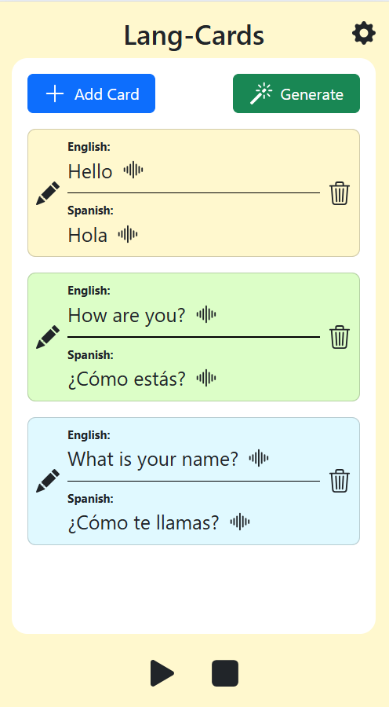

# Lang-Card

A simple yet powerful flashcard web app to help you learn new languages.

**Version 1.0.0 includes:**

- Individual card playback
- Auto-generate cards with random words
- Edit cards
- Delete cards
- Settings to change original and translated languages
- Playlist mode to play all cards in a row
- Fast and modern UI built with **React, Vite, Bootstrap and Tailwind CSS**
